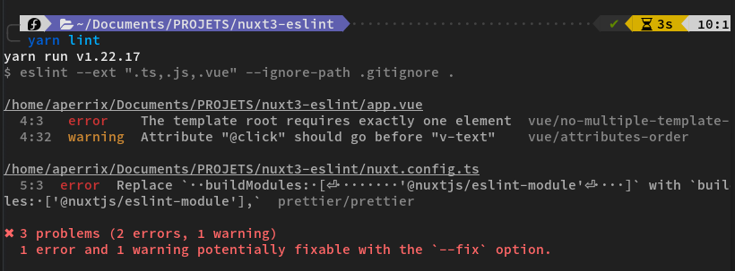

# Nuxt 3 + @nuxtjs/eslint-module + prettier example

A minimal install of nuxt 3 to which i added @nuxtjs/eslint-module and prettier to prove that the module is compatible and help the community.

Let me know if i have forget something ! (I intentionally left errors in the code so you can see that it works)

## How to use
``` bash
git clone git@github.com:Aperrix/nuxt3-eslint-example.git

yarn install

yarn build

yarn dev

# yarn lint
```

## Screenshots
